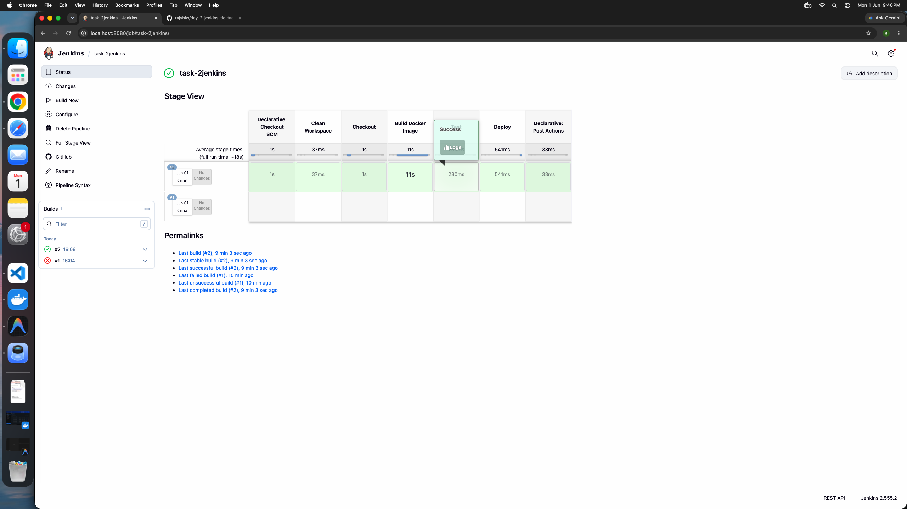
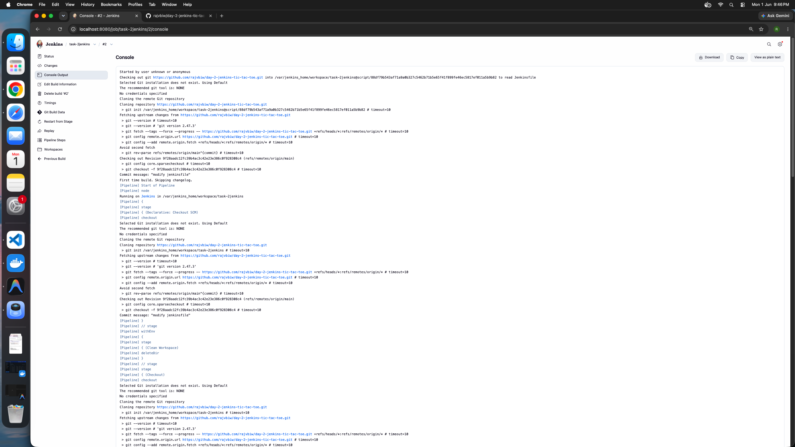

# TicTacToe CI/CD DevOps Project

## 📌 Project Overview

This project demonstrates a complete CI/CD (Continuous Integration and Continuous Deployment) pipeline using Jenkins, Docker, and Git for a TicTacToe web application.

## ✅ Objective

Set up a basic Jenkins pipeline to automate the process of building and deploying an application.

## 🧰 Tools

* Jenkins
* Docker
* Git

## 🎯 Deliverables

* A Jenkins pipeline file (`Jenkinsfile`) to build and deploy the app.

## 🔧 Steps performed

1. Installed Jenkins or used an existing Jenkins instance.
2. Created a `Jenkinsfile` in the project repository with pipeline stages for checkout, build, test, and deploy.
3. Configured the Jenkins job to use the repository URL `https://github.com/rajvbiw/day-2-jenkins-tic-tac-toe.git` and to trigger the pipeline on every commit.
4. Added stages in the pipeline:
   * `Checkout` to clone the repository.
   * `Build Docker Image` to build the application container.
   * `Test` to run verification commands.
   * `Deploy` to run the Docker container.
5. Verified the pipeline by pushing changes to the repository and checking the Jenkins dashboard for successful execution.

The repository now contains a `Jenkinsfile` at the project root that defines these automated steps.

---

# 🚀 Technologies Used

* Docker
* GitHub Actions
* DockerHub
* GitHub

---

# 📂 Project Structure

```bash
tictactoe/
│
├── public/
├── screenshot/
│   ├── jenkins-dashboard.png
│   └── jenkins-console-output.png
├── server.js
├── Dockerfile
├── package.json
├── README.md
└── tasks.json
```

---

# ⚙️ CI/CD Workflow

The CI/CD pipeline is implemented using GitHub Actions.

## Workflow Steps

1. Developer pushes code to GitHub
2. GitHub Actions workflow automatically triggers
3. Docker image is built
4. Docker image is pushed to DockerHub

---

# 🐳 Docker Setup

## Build Docker Image

```bash
docker build -t tictactoe-app .
```

## Run Docker Container

```bash
docker run -p 3000:3000 tictactoe-app
```

## Open Application

```bash
http://localhost:3000
```

---

# 🔄 GitHub Actions Workflow

The workflow file is located at:

```bash
.github/workflows/main.yml
```

The workflow performs:

* Source code checkout
* DockerHub login
* Docker image build
* Docker image push

---

# 🔐 GitHub Secrets Used

The following GitHub Secrets were configured:

| Secret Name     | Purpose                |
| --------------- | ---------------------- |
| DOCKER_USERNAME | DockerHub Username     |
| DOCKER_PASSWORD | DockerHub Access Token |

---

# 📦 DockerHub Repository

Docker images are automatically pushed to DockerHub after successful workflow execution.

Example:

```bash
docker.io/rajvbiw/tictactoe-app
```

---

# 📖 Read and Learn from Documentation

## Docker Documentation

https://docs.docker.com/

## GitHub Actions Documentation

https://docs.github.com/en/actions

## DockerHub Documentation

https://docs.docker.com/docker-hub/

## Node.js Documentation

https://nodejs.org/en/docs

## GitHub Documentation

https://docs.github.com/

---

# 🎯 What I Learned

* How to containerize applications using Docker
* How to automate workflows using GitHub Actions
* How to build and push Docker images automatically
* How CI/CD pipelines work in real DevOps environments
* How to manage GitHub Secrets securely

---

# ✅ Project Outcome

Successfully implemented a CI/CD pipeline for a TicTacToe web application using:

* Docker
* GitHub Actions
* DockerHub

The pipeline automatically builds and deploys the Docker image whenever code is pushed to the main branch.

---

# �️ Screenshots

The following screenshots show the Jenkins pipeline in action:

* `screenshot/jenkins-dashboard.png` – Jenkins job dashboard and build status.
* `screenshot/jenkins-console-output.png` – Jenkins console output for the pipeline run.





---

# �👨‍💻 Author

Raj Birari
